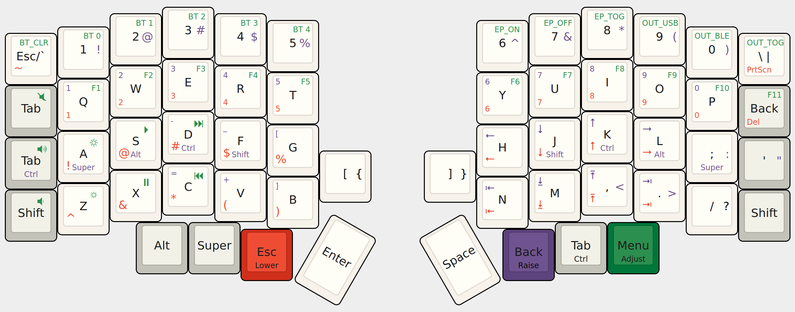
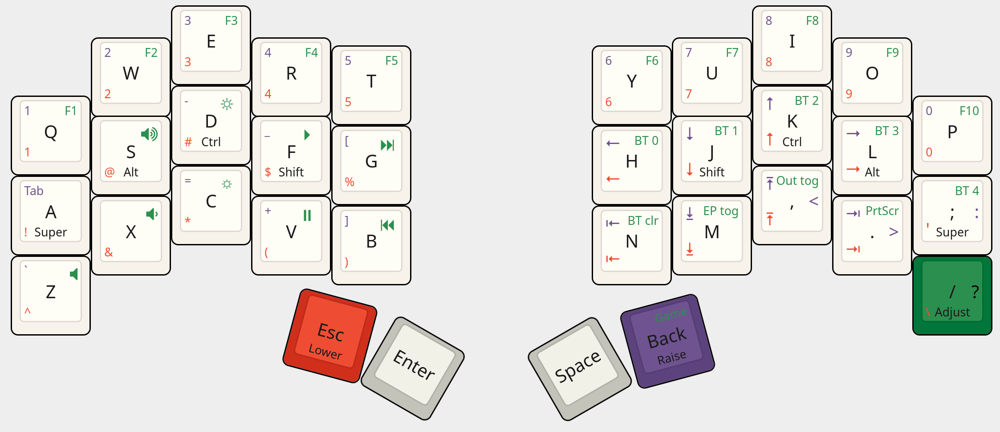

Lily58 & Corne & Ferris Sweep layouts by jhauh
==============================================

Standard zmk-config repo, push to kick off a GitHub Actions workflow
which will build the keyboard firmware to your liking and spit out
a zip of uf2 files in the Actions section of the repo.

Building locally
----------------

Also contains ``build_<shield>.sh`` scripts for building locally, if you
don't want github.com to be involved in the process of you remapping
your Caps lock key to Escape. Make sure your local pull of the zmk repo
is in the same directory as this zmk-config repo, then copy (or better
symlink) ``build_<shield>.sh`` to ``zmk/app/`` and run from there. It'll
dig the new uf2 files out of the resulting build folders and copy them
here for your convenience.

Keymap
------

Lily58
++++++

`(KLE link) <http://www.keyboard-layout-editor.com/#/gists/853b62b5eb7d15ec0cbc943373502cbf>`_

Corne
+++++

`(KLE link) <http://www.keyboard-layout-editor.com/#/gists/be3668c5e614b14871b6f26c297686a5>`_

Ferris Sweep
++++++++++++

`(KLE link) <http://www.keyboard-layout-editor.com/#/gists/7b49b1dd16d8bb93704317a0d8d27787>`_

